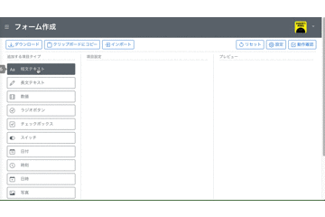

# vue-form-builder

# DEMO



デモサイトは<a href="#nogo">こちら</a>から

# Install

```
npm install vue-form-builder
```

# Setup

```
import swFormBuilder from sw-form-builder
```

# Usage

vue-form-builder は、以下の3つのコンポーネントで構成されています。

* フォーム作成コンポーネント
* 入力フォームコンポーネント
* データ表示コンポーネント

## フォーム作成コンポーネント / sw-form-editor

```
<template>
  <div>
    <sw-form-editor type_info="ALL" item_key_option="false" v-model="form_info" />
  </div>
</template>

<script>
  export default {
    data() {
      return {
        form_info: null
      }
    }
  }
</script>
```

### Properties

|Property|Type|Default|Description|
|:--|:--|:--|:--|
|form_info|Object|null|null の時は、新規作成。v-model で取得した JSON Object をセットすると、編集モードとなる。|
|type_info|String or Array or Number|"ALL"|"追加する項目"に表示する項目を指定。※別表を参照|
|item_key_option|String|"false"|"true" or "false" を指定すること。項目キーの入力フィールドの表示/非表示を指定する。|

### v-model

|Property|Event|Description|
|:--|:--|:--|
|value|update|フォームの定義されたデータが出力される。|

## 入力フォームコンポーネント / sw-form-inputter

```
<template>
  <div>
    <sw-form-inputter :form_info="form_info" v-model="form_data"" />
  </div>
</template>

<script>
  export default {
    data() {
      return {
        form_info: null,
        form_data: null
      }
    }
  }
</script>
```

### Properties

|Property|Type|Default|Description|
|:--|:--|:--|:--|
|form_info|Object|null|フォーム作成コンポーネントで取得したobjectを指定する|

### v-model

|Property|Event|Description|
|:--|:--|:--|
|value|update|フォームで入力されたデータが出力される。|

## データ表示コンポーネント

```
<template>
  <div>
    <sw-form-viewer :form_data="form_data" 
          pdf_output pdf_output_button="PDF出力" pdf_output_placement="top" />
  </div>
</template>

<script>
  export default {
    data() {
      return {
        form_data: null
      }
    }
  }
</script>
```

### Properties

|Property|Type|Default|Description|
|:--|:--|:--|:--|
|form_data|Object|null|フォーム入力コンポーネントで取得したobjectを指定する|
|pdf_output|boolean|false|true:PDF出力ボタンを表示する / false:PDF出力ボタンを表示しない|
|pdf_output_button|String|"PDF出力"|PDF出力ボタンの名称|
|pdf_output_placement|String|"top"|PDF出力ボタンの表示位置 "top":先頭 "bottom":最後尾|

